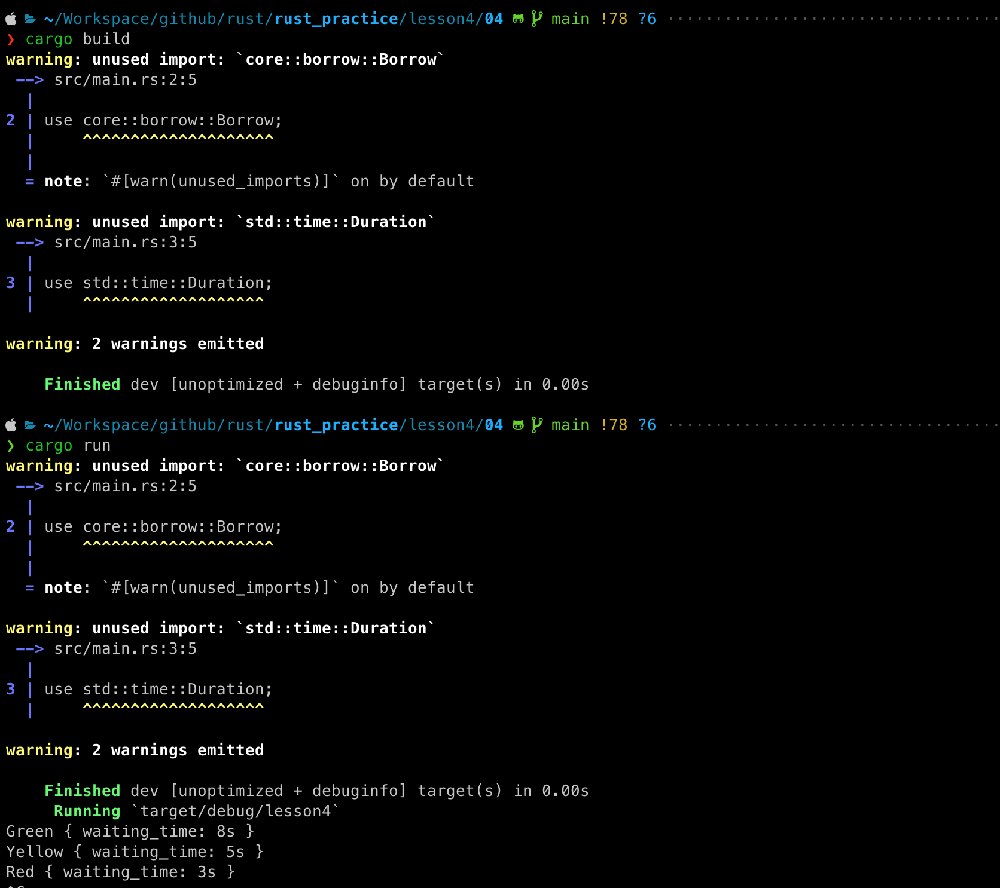
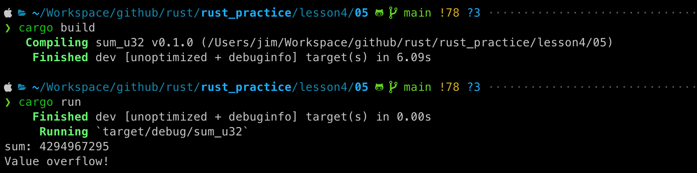
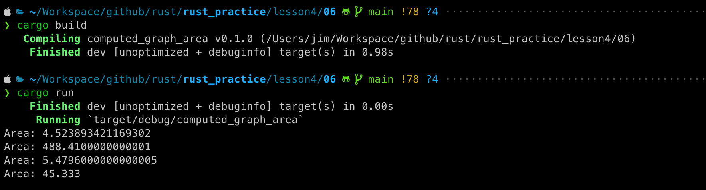

# 作业

## 04.为枚举交通信号灯实现一个trait，trait里面包含一个返回时间的方法，不同的灯持续的时间不同，可以上传代码片段，或者代码链接；
[源码地址](04/src/main.rs)

## 05.实现一个函数，为u32类型的整数集合求和，参数类型为&[u32]，返回类型为Option<u32>，溢出时返回None，可以上传代码片段，或者代码链接；
[源码地址](05/src/main.rs)

## 06.实现一个打印图形面积的函数，它可以接收一个计算面积的类型作为参数，比如圆形，三角形，正方形，需要用到泛型和泛型约束，可以上传代码片段，或者代码链接。
[源码地址](06/src/main.rs)

